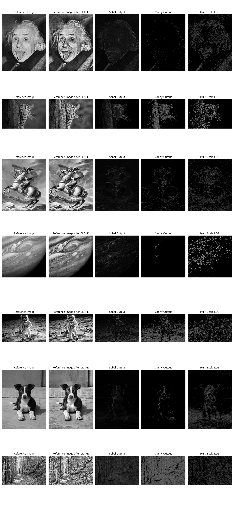
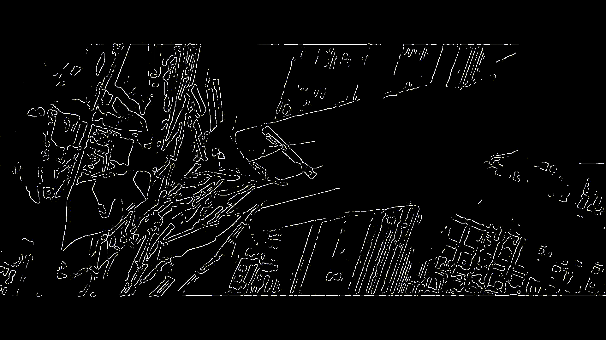
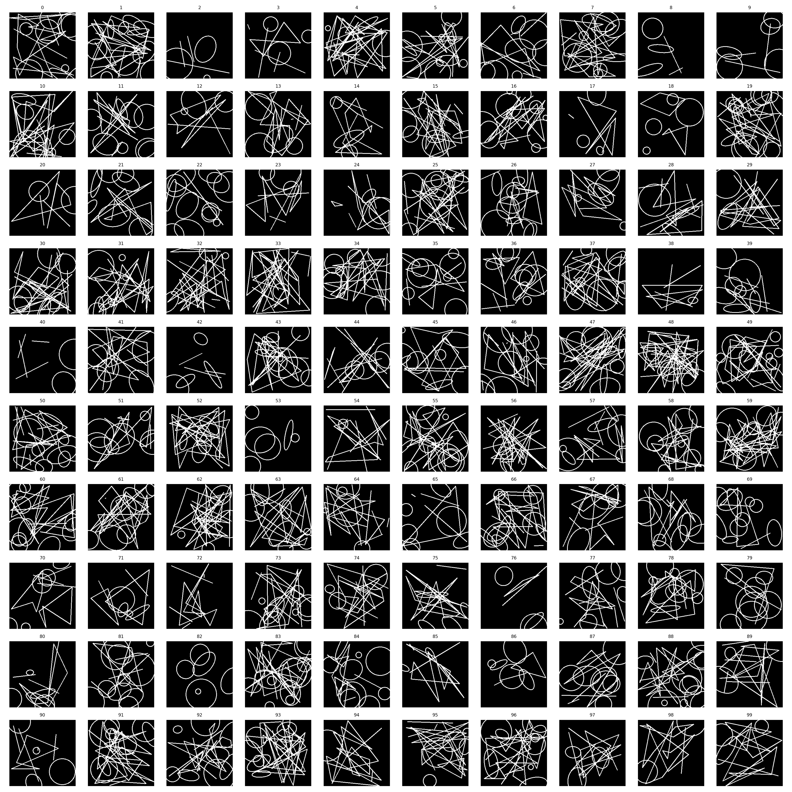
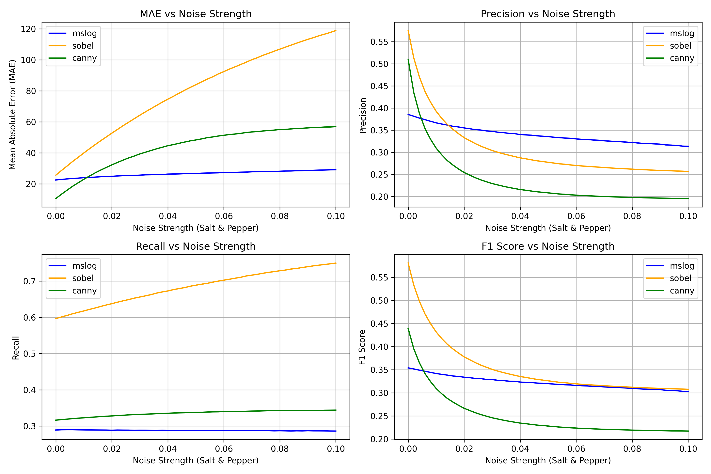

# Real-Time Multi-Scale Edge Detection Pipeline

A GPU-accelerated edge detection system for images and videos using **CLAHE**, **Multi-Scale Laplacian of Gaussian (LoG)** filtering, and **Zero-Crossing Detection**.

The project is designed to perform edge detection under:

- Low-light conditions
- Uneven illumination
- High image noise
- Real-time video constraints

The pipeline leverages **CUDA acceleration via CuPy** to achieve real-time performance for video processing.

---

# Features

- Multi-Scale Laplacian of Gaussian (LoG) edge detection
- Zero-Crossing based precise edge localization
- CLAHE-based adaptive contrast enhancement
- GPU acceleration using CuPy + CUDA

---

# Pipeline Overview

```
Input Image / Video
        ↓
Grayscale Conversion
        ↓
CLAHE
        ↓
Multi-Scale LoG Filtering
        ↓
Zero-Crossing Detection
        ↓
Edge Fusion
        ↓
Final Edge Map
```

---

# Technologies Used

- Python
- OpenCV
- NumPy
- CuPy

---

# Project Structure

```text
├── process_video_cupy.py
├── clahe.py
├── multi_scale_cupy.py
├── basic_log_cupy.py
├── requirements.txt
├── README.md
├── assets/
```

---

# Requirements

- NVIDIA GPU
- CUDA Toolkit installed and configured
- Python 3.9+

---

# Installation

## 1. Clone the repository

```bash
git clone https://github.com/criticalfernet/Edge_Detector
cd Edge_Detector
```

## 2. Create a virtual environment

```bash
python -m venv venv
```

### Linux / macOS

```bash
source venv/bin/activate
```

### Windows

```bash
venv\Scripts\activate
```

## 3. Install dependencies

```bash
pip install -r requirements.txt
```

---

# Usage

Run the pipeline using:

```bash
python process_video_cupy.py --input "input path" --output "output path"
```

Example:

```bash
python process_video_cupy.py --input input.mp4 --output output.mp4
```

---

# Results

## Comparisons



---

## Video Demonstrations




---

# Performance

- GPU-accelerated convolutions using CuPy
- Parallelized LoG filtering and zero-crossing operations

---

# Quantitative Evaluation

The model was evaluated against Sobel and Canny edge detectors using synthetic datasets with salt-and-pepper noise.



---

# Applications

- Autonomous navigation
- Surveillance systems
- Medical imaging
- Object detection preprocessing
- Computer vision pipelines

---

# References

1. Gonzalez & Woods, *Digital Image Processing*
2. CLAHE and LoG research papers
3. OpenCV Documentation
4. CuPy Documentation
